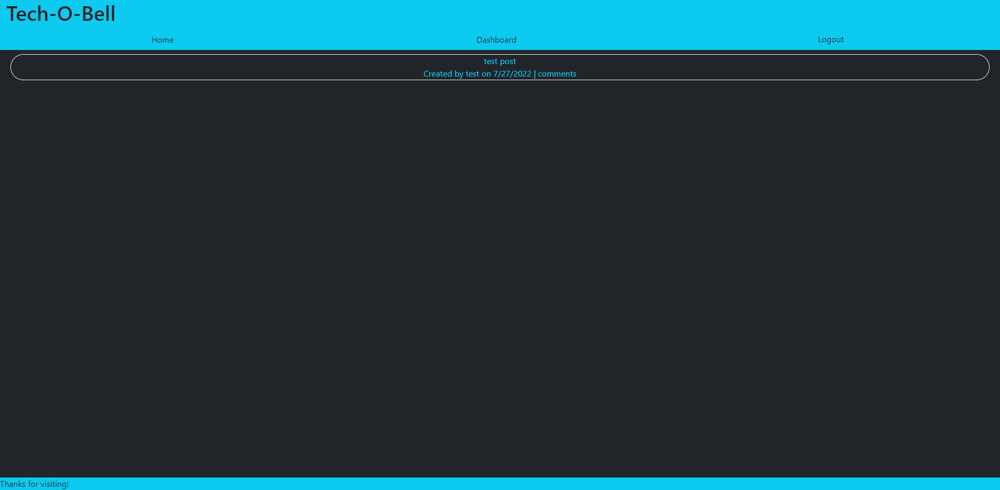

# Tech-O-Bell

## Summary
 Tech-O-Bell is a tech blog websites that lets the user create an account and post blogs and comment on other users blogs. The user can view all post from the homepage as well as view all of their post on the dashboard where they can edit all of their post and add comments to their own posts, in addition the user can also delete their posts.
## Code Breakdown
### Controllers
Following mvc patterns the controllers hold all query methods for the users, post and comments and exported to be used in the routes folder/files. All methods use standard sequelize querying methods and each method for all models are in charge of one specific query.

### Routes 
The routes folder is in charge of connecting both the query methods and handlebars. In the api folder each "-routes.js" file exports the specific models controller methods and connects them to the route they need. For the "index.js" file in the api folder, that is in charge of taking all the routes files and connecting them to the "index.js" file in the directory above. The dashboard and homepage routes render the whole page and all the different handlebars files that are needed. the "index.js" file in the routes folder mentioned earlier exports all of the routes to the "server.js" file

### Models
The Models are fairly simple, they're made as object models and only the user model has hook and a method.
The hook thats used hashes the users password using BCrypt to prevent any harm to the users sensitive information.
As for "index.js" file that handles the models relation to each other.
### Views
The Views folder has all of the websites html including the layout, all of the different pages and partials that are reused throughout the website. Data is inserted into handlebars and stylized with bootstrap.
### Server 
Server.js handles the creation of the server and keeps it connected to the database as well as everything else.
### Public Javascript
All of the from end javascript is help in /public/javascript. The js files in this directory handle everything that happens when the user interacts with websites from creating the users, post and comments to logging in and out users. 
### Utils
the utils folder contains the auth function used to make sure that users that aren't logged in cant make post, comment on them or delete them. It also contains the helper methods that formate the date and pluralize words. 
## Active Page
https://serene-mountain-27613.herokuapp.com/
## Screenshot
